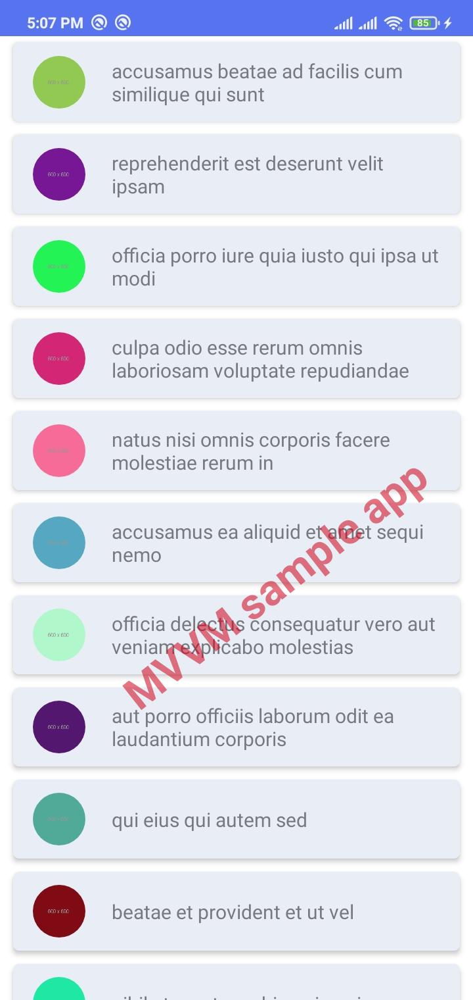

##Android-MVVM-Sample

### Demo

__UI__
  

  

### Dependencies

- <a href="https://developer.android.com/training/dependency-injection/hilt-android">Dagger Hilt</a>
- <a href="https://developer.android.com/topic/libraries/architecture/viewmodel">ViewModel</a>
- <a href="https://square.github.io/retrofit/">Retrofit</a>
- <a href="https://github.com/coil-kt/coil">Coil</a>
- <a href="https://developer.android.com/codelabs/kotlin-android-training-diffutil-databinding#0">Recycler data binding</a>
- <a href="https://developer.android.com/topic/libraries/data-binding/two-way">Two-way data binding</a>
- <a href="https://developer.android.com/training/testing/unit-testing/instrumented-unit-tests">Android Test</a>
- <a href="https://developer.android.com/studio/inspect/database">Room</a>

